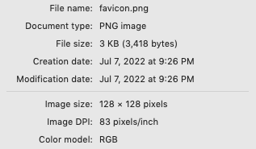
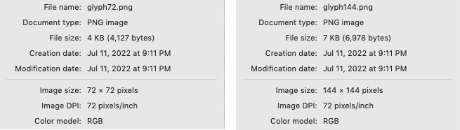
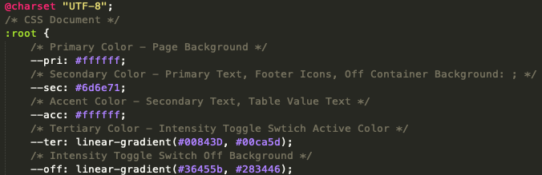
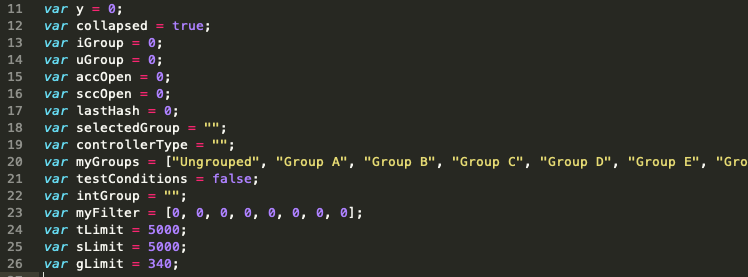
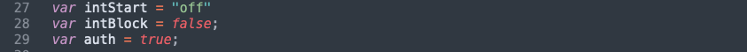
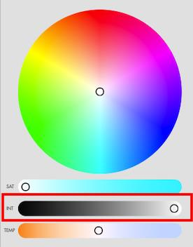
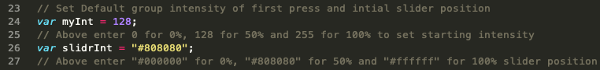
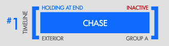

Customisation
=============

This starter custom web interface has also been created to act as an example system to allow others to use it as a jump off point to build their own interfaces or to customise this one. While all of the HTML, CSS and JavaScript code can be customised we provide a variety of out of the box easy thing you can customise.

Some of these customisations are achieved by working in the Designer 2 software, while others require edits to the web interface files that you unzipped and added to Designer during the installation step earlier in this document.

When we indicate what file needs to be edited, in the list of customisations below, we will do so by indicating the folder path where the file can be found. The current file structure looks like this on the right. Most of the files you will be working with will be:

* index.html
* login.html
* assets/images/logo.svg
* assets/images/favicon.png
* assets/scripts/pharos.js
* assets/colorpicker/demo.js
* assets/css/styles.css
* assets/css/editable.js

Changing the Logo
*****************

To change the logo shown at the top of the interface when larger screen sizes are used, you simply need to create your own logo in .SVG format and replace the assets/images/logo.svg file with your identically named file. Logos similar to the aspect ratio of the |Vendor| Logo will work best but the interface will constrain the height and width to be sure it fits best.

Change the Browser Favicon
**************************

To change the favicon that is shown within a web browser's bookmark and tab system you simply need to create your own favicon file and replace the assets/images/favicon.png file with your identically named file. Favicons require a specific resolution and size for them to be acceptable to your web browser.

Change the Icon Used for the iOS Homepage Bookmark
**************************************************

Two files are used to provide the icon that iOS will save to your home screen (See Apple Device Setup Above). One is for non-retina displays and the other a higher resolution for Retina screens. Those file files are assets/images/glyph722.png and assets/images/glyph1442.png

Changing the Colour Scheme
**************************

This interface has been provided with a quick and easy way to customise the colour scheme to re-theme the look of the interface. The use of CSS variables allows for the editing of a simple text file to change the colours of the interface. Open and review the file assets/css/ editable.css

In the example above you can edit the colour and gradient colours for each of the variables and they will affect the commented areas of the interface. After editing, don’t forget to put your new file with an identical name into the Designer Custom Web Interface files area. Review Installation above to be reminded where to remove and add files for this interface.

Limiting Displayed Triggers
***************************

As with the standard web interface that runs on all controllers, a trigger can be omitted from the list presented to the web interface user by un-checking the “Include box while in the Designer software. This does not disable the trigger, just prevents it from showing on any/all web interfaces.

Limiting Displayed Groups, Timelines and Scenes
***********************************************

There are times in your programming that certain timelines, groups and scenes do not want to be operated by a user from the web interface. This interface allows you to set a limit to which of these elements will be presented for operation via this customer web interface. This is done by setting a numerical limit to the objects. Any timeline, scene or groups that is more that the limit set will not show up in the interface. For Example: If you had a series of timelines being used for complex timers, you may not want those to appear on the interface. If we set those timelines to above the number 500 and put a limit on timelines at 500, they would not appear in the customer web interface.

To make these settings, three variables in the JavaScript code have been created:

* tLimit - timeline limit
* sLimit - scene limit
* gLimit - group limit

Changing these variables requires you to edit the assets/scripts/pharos.js and add your newly editing file to the web interface file area in the Designer software. This variable can be found around line 24 as show here.

Change the Authentication Timeout
*********************************

This interface will log you out after 5 min regardless of activity. Enhancements to this circumstance are under way. However, if you are using the interface without authentication, not using a username and password to gain access, then you might want to turn off the logout timer. To change this setting, one variable in the JavaScript code has been created that you can modify:

* auth
    * ``true`` for 5min logout
    * ``false`` for no forced logout

Changing this variable requires you to edit the assets/scripts/pharos.js and add your newly editing file to the web interface file area in the Designer software. This variable can be found around line 29 as show here.

Changing the Starting Intensity of Group Overrides
**************************************************

By default, when you open the Overrides page, the Intensity Slider is at 0% to start with. This must be adjusted above 0% before a chosen group will change colour to your selection.

This default setting can be changed so that changing the colour will immediately move to the new colour selection at a custom default intensity.
To make these settings, two variables in the JavaScript code have been created for you to edit.

* ``myInt`` - the starting intensity value (0-255)
* ``slidrInt`` - the default position of the intensity slider (string of “#000000” to “#FFFFFF”)

Changing these variables requires you to edit assets/colorpicker/demo.js and add your newly editing file to the web interface file area in the Designer software. These variables can be found around line 23 as show here.

.. note::
    Variable slidrInt that governs the slider's position uses a RGB colour value to define its background colour and position. Using RGB black at RGB (000,000,000) and RGB white at RGB (255,255,255) will yield the black to white track colour that is desirable as well as the proper position of the handle. In this file colour values are written as hexadecimal.

Add a Custom Zone Name to Timeline and Scenes for the Dashboard
***************************************************************

Designer 2 allows you to create custom properties for Fixtures, Layouts, Scenes and Timelines. By adding a customer property name Zone for Timelines or Scenes, the interface will display that name in the lower left-hand corner of the Status Object when viewing the Dashboard page of the web interface. In the example below Timeline 1 was given a Zone name of Exterior and this is now presented on the dashboard page.

