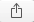

Installation
############

Install the |Vendor| Starter Web Interface for use with your |Vendor| projects.

#. Download the Starter Web Interface files from the |Vendor| |Designer| Software page on the ETC website at etcconnect.com/Products/ArchitecturalSystems/Mosaic/Designer-2-Software/Software.
#. Unzip the files. The provided resources in the unzipped folder are required for the Starter Web Interface.
#. Open your project configuration in |Vendor| |Designer| Software.
#. Navigate to the Projects view and select the Project Properties tab to verify the Controller API is set to the latest version available.
#. Navigate to the Projects > Web Interface tab and locate the Custom Web Interface section
#. Select the **Edit Files** button. The Custom Web Interface window displays.

   .. image:: ../img/custom_files.png

#. Either import the files or drag and drop the contents of the previously unzipped Starter Web Interface files into the "Custom Web Interface" window.

   .. image:: ../img/custom_files_list.jpg

#. Close the Custom Web Interface window, save your project file and upload.

This Interface was created specifically for API version 6.0. Future API releases may need modification to ensure continued functionality. This setting can be found in the Project view in Designer 2 under the tab Project Properties.

Apple iOS Device Setup
**********************

Using this interface on Apple mobile devices such as iPhone and iPad have an extra setup step that will make the user experience feel like they are using a native Apple Store App.

Apple devices can display this interface in a mode where the Safari web browser controls, URL bar and other menu items are hidden. In this mode, your lighting system interface works and feels like a touch screen

Step by Step:

#. Open the Safari browser and navigate to your controller’s IP address.

   * If you are presented with a login screen you MUST login first; once you have access to the interface, move on to step 3.

#. Tap this icon |apple_popout| to bring up the sharing menu.
#. Scroll down to the selection called “Add to Home Screen” and following the prompt to name the bookmark it will be placing on your home screen.
#. Once this is done, go back to Safari can close the tab or quit.
#. Navigate back to you home screen, find and launch the bookmark icon that has been newly added to you home screen.

.. note::
  For best results using a device as a semi-permanent control station, you may want to disable certain iOS features like screen timeout, automatic device lock, Bluetooth, and Live Text. You can also read up on using the iPad in Supervised Mode by installing the Apple Configurator App. In this mode your interface can be the only App that the device will present to a user.
