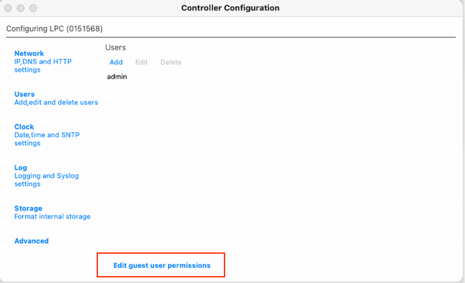
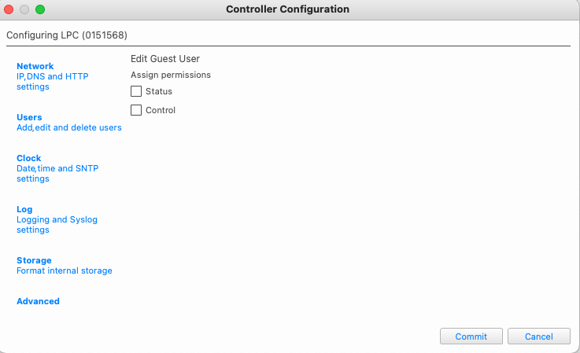
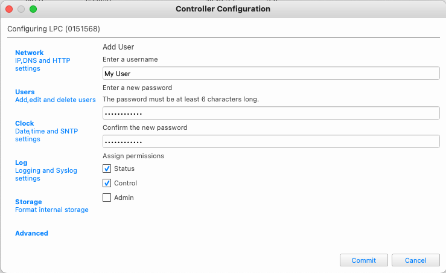

Security
########

Authentication
==============

Starting in Designer 2.9, a more secure way of managing hardware access has been rolled out. Instead of adding users and passwords to your project file, this is now done on the hardware via the Controller Configuration setting from within Designer or on the controller’s built in standard web interface. To learn more about these new security features and setup please visit the in-app or online help for Designer 2.9.

Upon connecting to a new controller for the first time, you will be asked to turn on security or proceed without security. If you leave it off, this custom web interface will function without the need to login or logout.

If you choose to secure the controller, you will need to setup a guest access level and add users and passwords to govern who can log in and use the interface to operate the project file.

Setting up Guest Access
=======================

Visit the Designer Network tab, choose your controller and then choose Controller Configuration from the menu. This will open a new window with all the hardware settings. Navigate to Users and then guest permissions at the bottom. A new screen will appear where you can choose if a guest can have permission to use the custom interface without logging in. Check both boxes if that is the intent

Setting up Users
================

To provide a secure control environment for this interface, again visit the controller configuration settings page in Designer and add user and password combinations as well as indicate what access level they should have. Only users with Control or Admin permissions will be able to use the interface if the hardware is using security and guest access has been restricted.

Logging In with a Username and Password
=======================================

If you have secured your controller with users and passwords, upon launching this interface you will be asked to login by being directed to a special login page. Upon successful login, you will be re-directed back to the working interface. This interface has been designed for users with an access level of Control and Admin. Users with a Status level access permission will not be able to log into this user interface.

.. note::
    Every 5 minutes the interface will log the user out and the user must log back in. There is a custom variable that can remove this feature that is discussed later in the customization section of this document.
