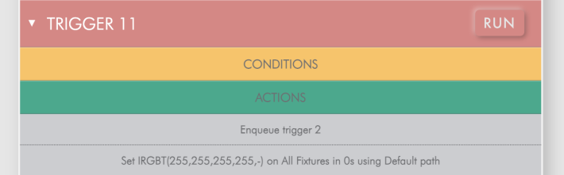

Using the Interface
###################

To access the Web Interface, simply navigate to the Controller's IP address from your web browser on your PC, Mac or mobile device. Your device and the |Vendor| Controller do need to be connected to the same Ethernet and/or Wi-Fi network.

Dashboard
*********

Due to the responsive features of the web interface, your home page experience with may differ according to the screen size. The content on the home page generates automatically according to the elements in your project.

.. list-table::
   :widths: 33 33 33
   :header-rows: 1

   * - Example PC
     - Example Tablet
     - Example Mobile
   * - .. image:: vendor_img/dashboard_pc.png
     - .. image:: vendor_img/dashboard_tablet.png
     - .. image:: vendor_img/dashboard_phone.png

On PC and tablet, the system dashboard includes, by default, active timelines and scenes, master intensity status and active sliders for configured groups, as well as project and system information.

On mobile, icons provide quick access to the related element controls.

Playback
********

.. list-table::
   :widths: 80 20
   :header-rows: 1

   * - Example PC/Tablet
     - Example Mobile
   * - .. image:: vendor_img/playback_pc.png
     - .. image:: vendor_img/playback_phone.png

On larger screens, timelines and scenes appear in separate sections. For smaller screens and mobile devices, they are grouped together and accessible via a toggle switch.

To start a timeline or scene, simply select a timeline or scene from the playback page and it will play automatically. If you have placed your timelines and scenes in groups in Designer, they will be sorted as such in collapsible groups, up to a maximum of 8 groups. Any timelines or scenes that haven’t been grouped will show up in the “Ungrouped” section.

For timelines and scenes that are grouped, you can utilize the Release All In Group First toggle switch and when a new timeline or scene is selected, the other timelines and scenes in the same group will be released before the new timeline or scene is played. Note that if you have Release All In Group First selected, and you play a timeline or scene from the “Ungrouped” section, then all of the timelines and scenes in every group will release prior to starting your selection.

This Interface operates with **last action takes precedence** rules. This means each timeline or scene choice takes over from any previously that are onstage. Master Intensity levels will persist and are updated in real time.

Triggers
********

.. list-table::
   :widths: 80 20
   :header-rows: 1

   * - Example PC/Tablet
     - Example Mobile
   * - .. image:: vendor_img/triggers_pc.png
     - .. image:: vendor_img/triggers_phone.png

This Interface provides a triggers page which allows you to run any of the triggers you have created in your show file. You can control which triggers show up on your triggers page by navigating to the Triggers tab in Designer 2, selecting the trigger(s) you wish to exclude from the interface, and unchecking the Included box. This will remove the selected triggers from the triggers page. The name given to the trigger in Designer 2 will be the name of the trigger in the interface. If you have no triggers in Designer 2, this page will not appear.

Triggers can be expanded to reveal both conditions and actions.

The trigger list can be filtered by groups, which can be chosen in the Triggers tab of Designer 2. There are 7 groups in total including triggers that are ungrouped. To run a trigger, simply select the RUN button associated with each trigger. An alert will confirm that the trigger has run. Finally, you can choose to test any conditions associated with your triggers by selecting the Test Conditions toggle switch.

Overrides
*********

.. list-table::
   :widths: 80 20
   :header-rows: 1

   * - Example PC/Tablet
     - Example Mobile
   * - .. image:: vendor_img/overrides_pc.png
     - .. image:: vendor_img/overrides_phone.png

The overrides page allows you to set custom looks for both colour fixture groups as well as tuneable white light fixture groups. Any group that you create in the Layout tab of Designer 2 will appear in the Groups section of this page, along with a group for All. On larger screens the colour picker will appear with 3 sliders. Saturation, intensity, and colour temperature. On smaller screens, the saturation slider is hidden.

The colour temperature slider will affect colour fixtures just as the colour picker and saturation slider will affect white light fixtures. Therefore, it is strongly recommended that you group your tuneable white light fixtures together and name them accordingly.

It is important to note that the intensity slider for the colour picker defaults to 0. This means that any changes you make won’t affect your fixtures until you raise the intensity slider above 0. This was done to keep end users from accidentally making unwanted changes to fixtures.

These custom looks are considered overrides by your controller. Note that these looks are for manual control and are not stored on the controller. They are set to “normal” priority and are subject to the last takes precedence rule. You can change the priority of your overrides in the Project tab of Designer 2 in the Project Properties section. Any priority that is higher than normal will override the last takes precedence rule, providing your timelines and scenes are set to Normal priority.

Master Intensities
******************

.. list-table::
   :widths: 50 50
   :header-rows: 1

   * - Example PC/Tablet
     - Example Mobile
   * - .. image:: vendor_img/master_intensity_pc.png
     - .. image:: vendor_img/master_intensity_phone.png

The Intensities page provides the user with a master intensity slider for every group created in Designer 2. On larger screens each group has a slider and a toggle switch that are visible directly on the page. On smaller screens a button with a toggle switch is provided for each group. Selecting the button will take you to an additional page that has a dial for intensity as well as a back button..

The toggle switches for the intensity sliders and the intensity buttons operate as on/off only. If you toggle on, the intensity is set to 100%. If you toggle it off, intensity is set to 0%. Any previously set levels will need to be readjusted manually.
In addition, these levels are master intensities. Starting new timelines or scenes will not affect the master intensity values like they do for overrides. If you set the level to 50% and want the level back at 100%, you will need to set the level back to 100%.

All Off
*******

.. list-table::
   :widths: 80 20
   :header-rows: 1

   * - Example PC/Tablet
     - Example Mobile
   * - .. image:: vendor_img/all_off_pc.png
     - .. image:: vendor_img/all_off_phone.png

The All Off page provides the user with a method to release timelines, scenes, or to clear any manual overrides individually, or any combination of the three at once. These are global releases of timelines and scenes, and a complete release of all overrides. If you need to release specific timelines or scenes, then you can do so from the Playback page by simply toggling the active buttons.
